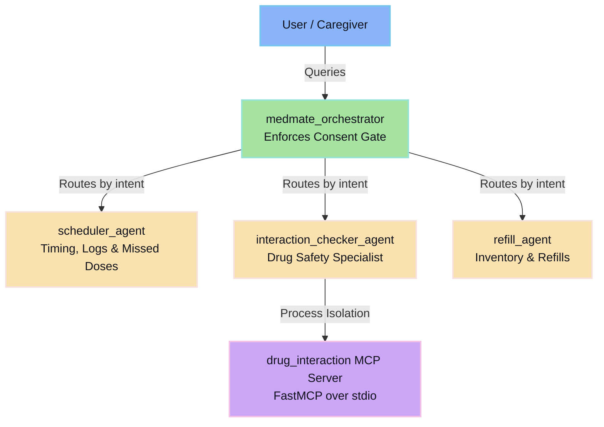

# MedMate — a concierge agent for managing household medications safely

**Track:** Concierge Agents
**Built for:** Kaggle's AI Agents: Intensive Vibe Coding Capstone Project

## The problem

Managing medications for yourself or an aging parent is tedious and
error-prone in exactly the way that's dangerous: easy-to-miss doses,
easy-to-miss drug interactions, and refills that get noticed only after
the bottle is already empty. It's also deeply personal data that most
"smart assistant" demos handle carelessly.

## The solution

MedMate is a multi-agent concierge that splits this problem across three
narrow, auditable specialists behind a single orchestrator, so each piece
stays simple enough to reason about and test independently.



## Why agents, specifically

A single-prompt chatbot can *talk about* medications. It can't safely hold
state across a conversation (what's already scheduled, what's already in
inventory), call out to a structured interaction-checking tool, and enforce
who's allowed to see what. Splitting this into an orchestrator + specialist
sub-agents means each piece has a narrow, testable responsibility, and the
consent gate sits in exactly one place (the orchestrator) rather than being
re-implemented per feature.

## How this maps to the course's key concepts

| Concept | Where it shows up |
|---|---|
| Multi-agent system (ADK) | `medmate_agent/agent.py` — root orchestrator with 3 sub-agents, automatic intent-based routing |
| MCP Server | `mcp_server/drug_interaction_server.py` — standalone FastMCP server; consumed via `McpToolset` in `medmate_agent/tools/interaction_mcp_client.py` |
| Antigravity | Built and iterated in the Antigravity IDE using the ADK 2.0 graph workflow + `agents-cli` toolchain |
| Security features | `medmate_agent/tools/security_gate.py` (consent gate + audit log) and `security/THREAT_MODEL.md` (full STRIDE writeup) |
| Deployability | `deploy/DEPLOYMENT.md` — reproducible `agents-cli deploy agent-runtime` steps |
| Agent skills | `skills/medication-parser/SKILL.md` — Antigravity Skill for parsing free-text medication descriptions |

## Project structure

```
medmate_agent/         ADK agent package (the deployable unit)
  agent.py             root_agent (orchestrator)
  sub_agents/           scheduler_agent, interaction_checker_agent, refill_agent
  tools/                FunctionTools, MCP client wiring, security gate
mcp_server/             standalone MCP server (drug interaction checks)
skills/                 Antigravity Skills
security/               STRIDE threat model
deploy/                 deployment instructions
tests/                  pytest suite (no live API calls required)
```

## Setup

### Prerequisites
- Python 3.10 or higher
- A free Google AI Studio API key from [aistudio.google.com](https://aistudio.google.com)

### Installation

```bash
# 1. Clone the repo
git clone https://github.com/Codewithkhushi-arch/medmate
cd medmate/medmate

# 2. Create and activate a virtual environment
python -m venv venv

# Windows
venv\Scripts\activate

# Mac/Linux
source venv/bin/activate

# 3. Install dependencies
pip install -r requirements.txt

# 4. Add your API key
cp .env.example .env
# Open .env and replace the placeholder with your real GOOGLE_API_KEY

# 5. Run the tests (no API key needed)
pytest tests/           # should show 8 passed

# 6. Run the interactive agent
adk run medmate_agent
```

### Try these prompts in order
Once `adk run medmate_agent` starts and shows `[user]:`, paste each of these:

1. `I take 500mg metformin twice a day with food` → scheduler_agent
2. `did I miss any doses today?` → missed dose check
3. `is it safe with warfarin and aspirin too?` → interaction_checker_agent via MCP server
4. `I have 10 pills left, when do I need to refill?` → refill_agent
5. `Grant access to caregiver_joe` → consent registry
6. `show my security audit logs` → filtered audit trail

### Browser UI (optional)
For a visual interface with agent routing traces:
```bash
adk web .
```
Then open `http://127.0.0.1:8000` in your browser.

### Standalone MCP Server Testing
The drug interaction checker runs as a separate process. To test it in isolation:
```bash
python -m mcp_server.drug_interaction_server
```

### Demo script
To run the full consent-gate demonstration (grant access, authorized check, blocked access):
```bash
python demo_consent_gate.py
```

## Design choices worth calling out

- **A human always sends refill requests.** `draft_refill_message` only
  ever drafts text; nothing is auto-sent. For anything medication-related
  that leaves the system, a human stays in the loop on purpose.
- **The consent gate runs before any sub-agent is reachable**, not as a
  per-tool check, so there's exactly one place to audit for access control
  correctness.
- **Auditable Security & Log access.** Every security gate choice (`access_granted` / `access_denied`) is logged in the `AUDIT_LOG` variable in `medmate_agent/tools/security_gate.py`.
- **The interaction checker only ever receives medication names**, never
  the rest of a patient's record, to minimize what crosses into the MCP
  server's process boundary.

## Known limitations

See `security/THREAT_MODEL.md` for a full list — in short, this is a
hackathon-scoped demo:
- **In-memory storage**: `_SCHEDULE_DB`, `_INVENTORY_DB`, `_DOSE_LOG`, and the security `AUDIT_LOG` reset on process restart. In production, these should be replaced with Firestore (using Customer-Managed Encryption Keys) and Cloud Logging.
- **Mock drug interaction table**: The MCP server uses a small local lookup table to avoid requiring external drug API keys during judging.
- **No authentication layer**: `user_id` is supplied directly for demo purposes. A production deployment would derive the user's identity from Google Identity Platform / OAuth tokens.


## License

Apache 2.0, consistent with the ADK and Antigravity codelabs this project
builds on.
